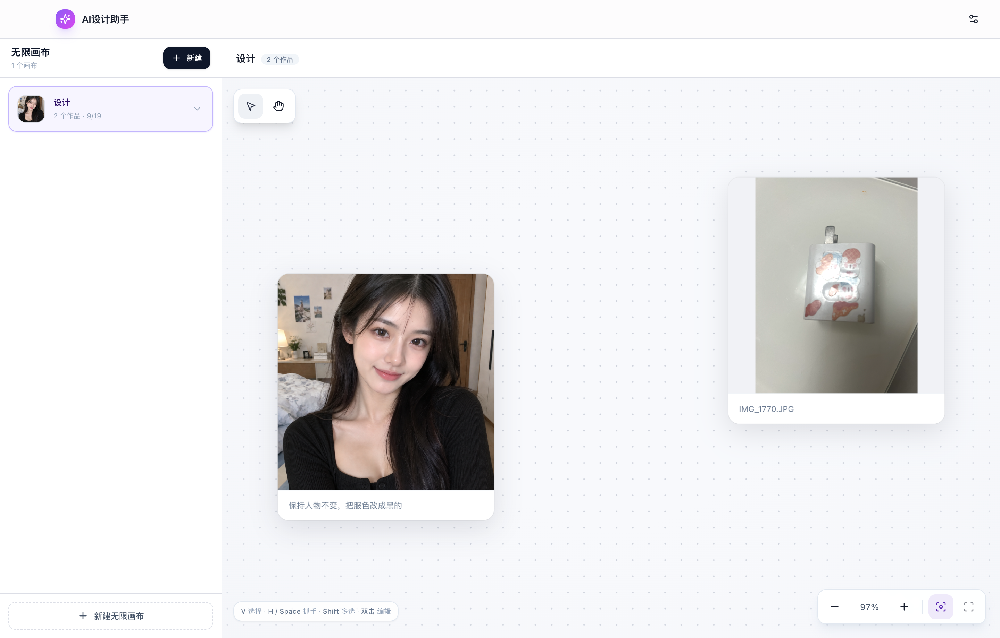

# AI设计助手

一款本地优先的桌面 AI 图片创作工具，支持多无限画布、文生图、图生图、图片编辑和版本管理。

> 这个仓库已经准备好用于 Vibe Coding。开始开发前，请先运行项目，再阅读需求文档并对照真实 UI 设计稿，不要只根据文字重新想象界面。



## Vibe Coding 入口

- [需求文档](./docs/需求文档.md)：产品目标、功能需求、交互规则、实现顺序和验收标准。
- [UI 设计稿目录](./docs/design/)：项目真实运行后截取的完整界面状态，不是概念图。
- [主界面](./docs/design/01-主界面.png)
- [新建画布](./docs/design/02-新建画布.png)
- [画布右键菜单](./docs/design/03-画布右键菜单.png)
- [新建图片](./docs/design/04-新建图片.png)
- [图片右键菜单](./docs/design/05-图片右键菜单.png)
- [删除确认](./docs/design/06-删除确认.png)
- [图片编辑器](./docs/design/07-图片编辑器.png)
- [图生图与版本](./docs/design/08-图生图版本.png)

## 当前已经实现

### 多无限画布

- 创建多个无限画布并录入名称。
- 点击画布卡片直接打开，并展开或收起图片元素列表。
- 画布卡片展示首张作品封面、作品数量和更新时间。
- 右键画布可以修改名称、新建 AI 图片或上传图片。

### 画布交互

- 无限平移和缩放。
- 选择工具、抓手工具、框选和多选。
- 图片节点自由拖动并持久化坐标。
- 适配全部内容和适配选中内容。
- 点击左侧图片元素后，在画布中选中并居中对应图片。

### 图片管理

- 上传本地图片到指定画布。
- 图片右键菜单支持编辑和删除。
- 删除前显示确认弹窗，并同时删除关联历史版本。
- 将图片以 PNG、JPEG 或 WebP 保存到本地。

### AI 图片生成

- 文生图和图生图使用两套独立模型配置。
- 支持 OpenAI 图片接口及兼容服务。
- 支持正方形、横图和竖图尺寸。
- 支持 `low`、`medium`、`high` 三档质量。
- 模型配置支持连接测试，可检查 API Key、网络和目标模型。

### 图片编辑与版本

- 亮度、对比度和饱和度实时调整。
- 左转、右转、水平翻转和垂直翻转。
- 原始图片自动保存为 V1。
- 每次图生图生成一个递增的新版本。
- 可以在版本列表中预览、选择和应用历史版本。
- 按图片原始分辨率导出调整结果。

### 本地持久化

- 画布、图片、提示词、坐标、版本和模型配置保存在本地。
- 使用 SQLite 数据库，不依赖远程业务服务器。
- Electron 渲染进程不直接访问 Node.js、数据库或本地文件系统。
- API 请求和文件保存统一由 Electron 主进程处理。

## 技术栈

| 层级 | 技术 |
| --- | --- |
| 桌面容器 | Electron 33 |
| 前端 | React 18 + TypeScript |
| 构建 | electron-vite + Vite |
| 样式 | Tailwind CSS + shadcn/ui 风格组件 |
| 图标 | Lucide React |
| 本地数据 | SQLite（sql.js） |
| AI 接口 | OpenAI Images API 兼容协议 |

## 快速运行

环境要求：

- Node.js 20 或更高版本。
- npm 10 或更高版本。
- macOS 或 Windows 桌面环境。

安装依赖并启动开发模式：

```bash
npm install
npm run dev
```

执行生产构建校验：

```bash
npm run build
```

预览生产构建：

```bash
npm run preview
```

## 第一次使用

1. 启动应用。
2. 点击右上角“模型配置”。
3. 分别配置文生图模型和图片编辑模型。
4. 使用“连接测试”检查 API 地址、API Key 和模型名称。
5. 新建无限画布。
6. 通过画布右键菜单生成或上传第一张图片。

没有配置模型时，上传图片、无限画布和本地基础编辑仍然可以使用。

## 推荐的 Vibe Coding 流程

1. 阅读 [需求文档](./docs/需求文档.md) 中对应模块的功能和验收标准。
2. 打开 [UI 设计稿目录](./docs/design/)，确认目标状态真实长什么样。
3. 执行 `npm run dev`，亲自操作当前功能，理解现有交互。
4. 使用 `rg` 找到对应组件和主进程接口，尽量复用现有结构。
5. 完成一个小闭环后立即在运行中的 Electron 应用内验证。
6. 执行 `npm run build`，保证 TypeScript 和三个构建目标全部通过。
7. 涉及 UI 的修改，在 `1440 × 920` 窗口下对照设计稿检查。

## Vibe Coding 约束

- 不要把无限画布改成普通图片网格或瀑布流。
- 不要制作只有视觉、没有实际行为的静态按钮和菜单。
- 保持顶部栏、320 px 左侧栏和右侧无限画布的主要结构。
- 保持灰白色界面和紫色选中反馈，不随意引入新的主色。
- 新建、生成、保存和删除操作必须有加载、成功或错误反馈。
- 删除等破坏性操作必须二次确认。
- 画布平移、缩放、选择、拖动和居中定位必须真实可用。
- 修改数据持久化逻辑时必须兼容已有本地数据。
- 不要在渲染进程中直接访问 API Key、文件系统或数据库。
- 需求文档与真实运行行为冲突时，先确认产品意图再大范围重构。

## 开发完成标准

提交代码前至少完成：

- 对应功能能够从 UI 入口完整操作成功。
- 取消操作不会产生数据变化。
- 失败状态有明确提示，不会伪装成成功。
- 重启应用后，已经保存的画布、图片、位置和版本仍然存在。
- `npm run build` 通过。
- 控制台没有由本次修改引入的持续错误。
- UI 修改与 `docs/design` 中的真实运行基线保持一致。

更完整的逐项验收标准请查看 [需求文档](./docs/需求文档.md#11-验收标准)。

## 本地数据位置

数据库文件名为：

```text
lumina-studio.db
```

数据库位于 Electron 的用户数据目录。为了兼容旧版本，产品改名为“AI设计助手”后仍沿用原来的 `lumina-ai-design-studio` 数据目录；旧版 `models.json` 会在首次启动时自动迁移。
